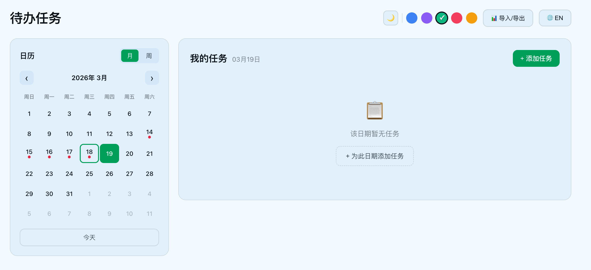
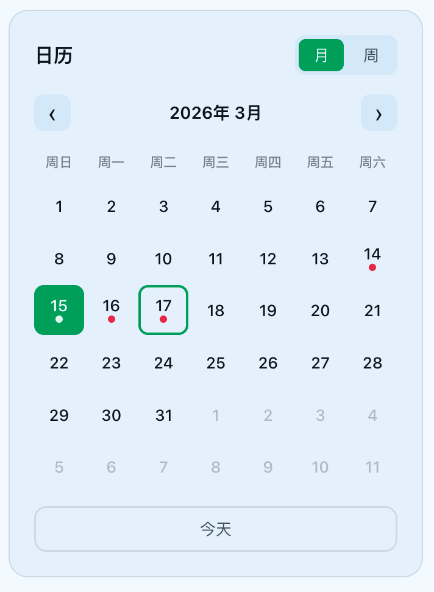
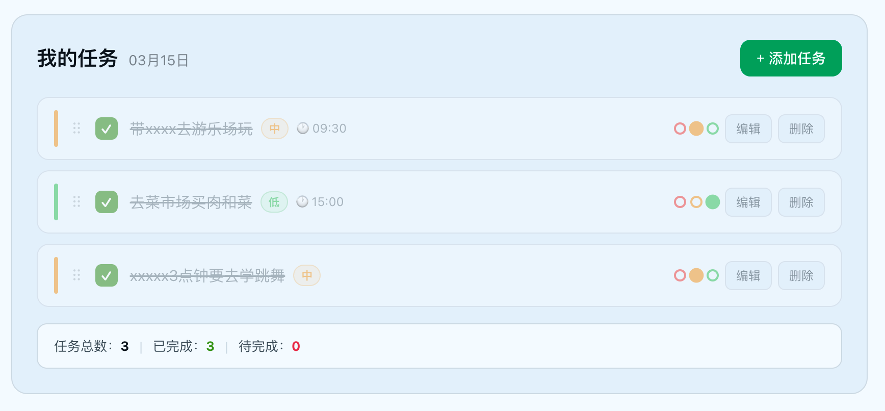
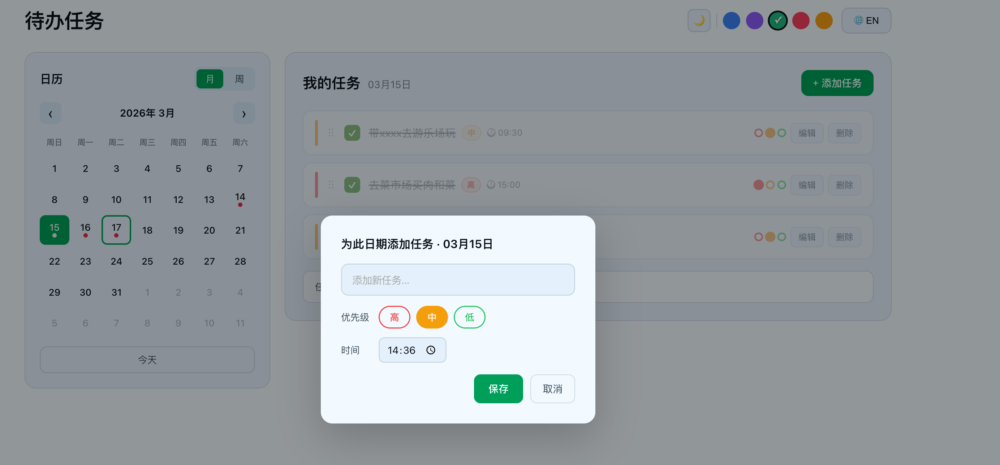
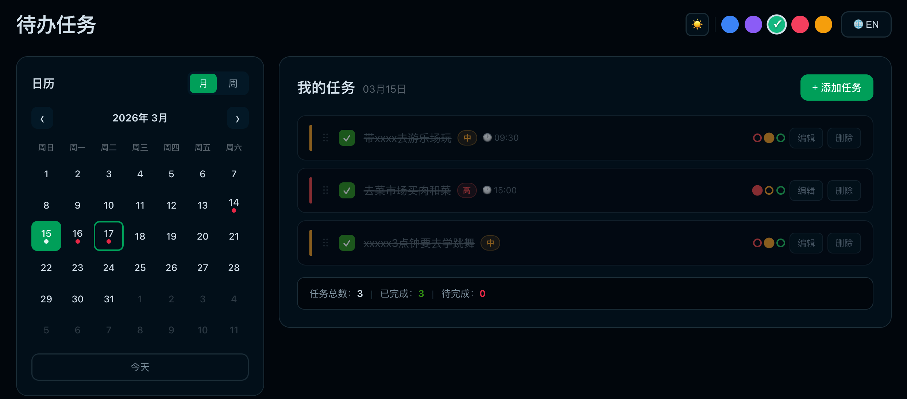

# 📋 Todo Calendar

一个基于 Vue 3 + TypeScript 的待办任务管理应用，支持日历视图、优先级、拖拽排序、数据导入导出等功能。



---

## ✨ 功能特性

### 📅 日历视图
- 月视图 / 周视图自由切换
- 有任务的日期显示红点标识
- 点击日历任意日期，右侧任务列表实时同步



### ✅ 任务管理
- 为指定日期添加任务，支持设置**时间**（默认当前时间）
- 支持任务**编辑**、**删除**、**完成勾选**
- 任务列表底部显示统计：总数 / 已完成 / 待完成



### 🎯 优先级
- 三级优先级：高（红）/ 中（黄）/ 低（绿）
- 任务卡片左侧色条 + 标签双重标识
- 可在任务列表中直接点击小圆点切换优先级



### 🖱️ 拖拽排序
- 任务卡片支持拖拽自由排序
- 拖拽时高亮目标位置，顺序持久化保存

### 📤 导出 Excel
- 选择日期范围，将该范围内所有任务导出为 `.xlsx` 文件
- 每个日期单独一个 Sheet，Sheet 名为日期（`YYYY-MM-DD`）
- 每个 Sheet 包含字段：序号、任务名称、时间、优先级
- 所有单元格格式为文本，避免时间等内容被 Excel 自动转换

### 📥 导入 Excel
- 支持点击选择或拖拽 `.xlsx` 文件导入
- 自动识别中英文列名，兼容导出文件直接回导
- 导入数据与现有任务合并，重复任务自动跳过

### 🎨 主题切换
- 5 套主题色：海洋蓝 / 薰衣草 / 抹茶绿 / 玫瑰红 / 琥珀橙
- 亮色 / 暗色模式一键切换
- 主题选择持久化，刷新不丢失



### 🌐 中英文切换
- 支持中文 / English 界面切换

---

## 🛠️ 技术栈

- [Vue 3](https://vuejs.org/) + Composition API
- [TypeScript](https://www.typescriptlang.org/)
- [Vite](https://vitejs.dev/)
- [SheetJS (xlsx)](https://sheetjs.com/) — Excel 导入导出
- localStorage 数据持久化，无需后端

## 📁 项目结构

```
src/
├── types/              # 类型定义
├── composables/        # 逻辑复用层
│   ├── useLang.ts      # 国际化
│   ├── useToast.ts     # 消息通知
│   ├── useCalendar.ts  # 日历逻辑
│   ├── useTaskActions.ts # 任务操作
│   ├── useTheme.ts     # 主题切换
│   └── useImportExport.ts # 导入导出
├── stores/
│   └── todo.ts         # 数据持久化
├── components/
│   ├── CalendarPanel.vue
│   ├── TaskPanel.vue
│   ├── TaskItem.vue
│   ├── AddTaskDialog.vue
│   ├── ImportExportDialog.vue
│   ├── ThemePicker.vue
│   └── AppToast.vue
└── App.vue
```

---

## 🚀 快速开始

```bash
# 安装依赖
npm install

# 启动开发服务器
npm run dev

# 构建生产版本
npm run build
```

---

## 隐私说明

所有数据均在本地浏览器中处理，导入导出文件不会上传到任何服务器。
